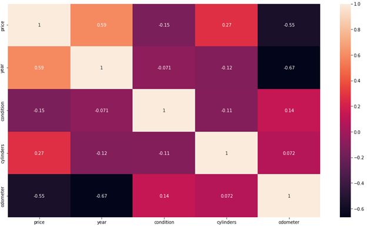
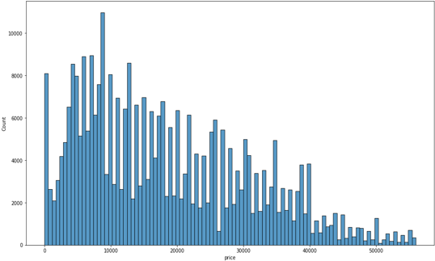
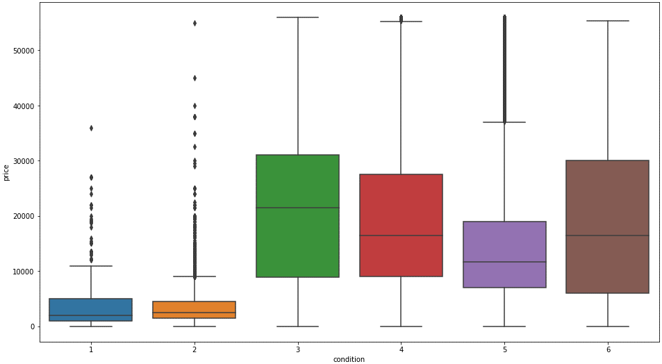
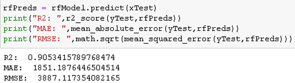
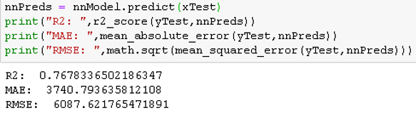

# Practicum-II-Used-Car-Analysis
The used car business is massive and one of the hardest parts to get right is finding the right price to resell any vehicle. How does mileage, year, make, etc., affect car price? And ultimately how much is my car worth? A big part of my family works in the automobile industry and that got me to thinking about how cars are priced and more specifically used cars. From talking to one used car associate I was told they use Kelly Blue Book to estimate their car prices. What I am trying to do here is mimic that.

## The Dataset
The dataset I used was retrieved from Kaggle and was scraped of Craigslist’s used car section from 2021. The dataset contains a little under 427k points. If you know anything about web scraping you know how difficult it can be to clean scraped data.  

Link: : https://www.kaggle.com/austinreese/craigslist-carstrucks-data

## Data Cleaning
 - Removed duplicates & irrelevant data
 - Ordinal and One-Hot Encoding
 - Imputing missing values (Iterative imputer)
 - Removed Outliers

## EDA
### Heat Map
 
Finally with a clean dataset I wanted to study the relationships within it. The first kind of graph I made was the heat map you see above. As you can see the attribute that most correlated with price was year followed by odometer.  This wasn’t really a surprise to me especially when you consider the first two things most people will ask when looking at a new car. What year is the car? How many miles does it have? 

### Histogram
 
This is the distirbution of car prices which appears to be skewed right. This makes sense since there are several more older used cars than relatively new used cars on the market

### Boxplot
 
Looking more into conditions we can see that even thou we don’t have a lot of data for salvaged and fair condition cars the data we do have suggests that they are priced very low compared to the rest. That being said , condition doesn’t look like it has much effect on price in at least this dataset. The heat map also suggest that with a correlation of -0.15. 

## RandomForest
 
The first modeling technique I thought would work well for this dataset was random forests. I used a train test split for testing and cross validation for training. Normally I wouldn’t use cross validation for a dataset this massive because of the time it would take to run but I figured I give it a go anyways. The results were pretty good as you can see with the optimal model using 480 trees. Looking at the RMSE we can see that are predictions are plus or minus about 3900$.Kelly blue books gives a low average and high and so basically the low would be minus 3900$ and the high would be plus 3900$. Honestly, I think these results are pretty good and so it just depends on how our next model performs. 

## Artificial Neural Network
 
The second method I thought would work great was a Neural Network. Due to the more power needed I couldn’t have a very large grid search. That unfortunately lead to a very poor performing model. As you can see all the numbers are down. A smaller R2 and twice as large error values. 

## Conclusion
To summarize, the best model to predict used car prices was my random forest. It had a higher R2 and lower error values. Things I could have done better are putting more time into training. I spent most of my time cleaning and left a lot of modeling ideas till the end. Additionally, now and days I see that part of a model's optimization is data cleaning. This dataset was so large and tedious to clean I didn’t really have the chance to try other cleaning methods due to the time constraint. The last thing I want to talk about here is the model’s maintenance. This model is legitimate for now but as time goes on new data will need to be fed into it to keep it functional. All in all, I had a great time working on this project and hope yall enjoyed my presentation. Thanks for watching and have a great day.
